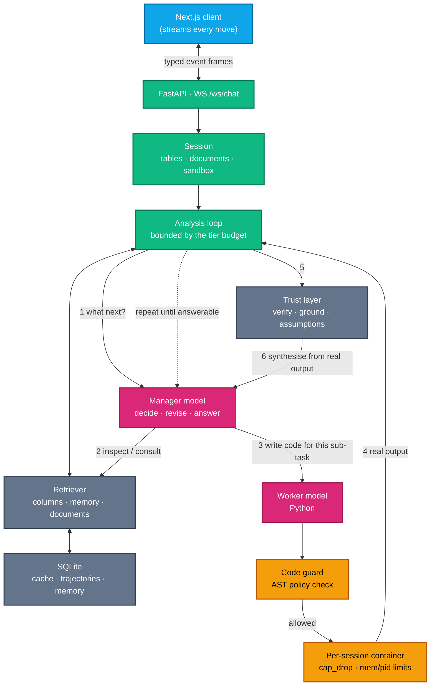

# 🧙‍♂️ Wizard w2

> A local-first autonomous data analysis agent. Ask a real question about your data; it investigates — looking, computing, revising its approach when the data disagrees with it — then verifies the result and explains it, streaming its reasoning as it goes.

     [](https://scorecard.dev/viewer/?uri=github.com/Wizard-AIA/Wizard-w2) [](LICENSE) [](https://wizard-aia.github.io/docs/)

Upgrading from w1? See [the migration notes](docs/wizard-w1-to-w2-migration.md) — most installs need to change nothing.

Full documentation, including task guides (EDA, model training) and an
[edge-cases & gotchas reference](https://wizard-aia.github.io/docs/troubleshooting/edge-cases/),
lives at **[wizard-aia.github.io/docs](https://wizard-aia.github.io/docs/)**.

## What it is

Wizard runs entirely on your machine. Your data never leaves it, and no API key is required by default — cloud providers are supported too, gated behind an explicit data mode (see below).

You upload a file (or connect a database) and ask a question in plain language. A **manager** model works out what to do; a **worker** model writes the Python. The code is statically screened, then executed in its own subprocess under OS-native sandboxing by default (Landlock/seccomp on Linux, `sandbox-exec` on macOS, a restricted job object on Windows) — or in a Docker container scoped to your session if you opt into that instead.

The important part is what happens next. Rather than following a plan fixed before anything ran, the manager sees the **real output** and decides what to do next — examine a column, compute something else, consult an attached document, revise the plan outright, or stop and answer. It repeats until it has an answer or runs out of budget. Real analytical questions are not one step; you find out the join key is dirty, or that "active customer" means three different things in three tables, only once you have looked.

Every stage streams to the browser as it happens — the reasoning, each move and what it found, the generated code, the program's stdout, and the answer token by token.

## Why you might want it

- **Local first.** Two small Ollama models are enough to be useful. Nothing is sent anywhere.
- **You choose the models.** Nothing is hardcoded — the app uses whatever your provider actually has, and you can assign a different model, on a different backend, to each role.
- **It sizes itself to your hardware.** A 1.5B model gets a short leash and deterministic fallbacks; a large model gets a long investigation. Same app, one setting, and `auto` works it out from the model itself.
- **It runs the code, it doesn't just suggest it.** Results come from execution, not from a model claiming an answer.
- **It checks its own work.** The headline result is recomputed by a different route, and any figure in the answer that appears in no execution output is flagged rather than quietly presented.
- **It tells you what it assumed.** Dropped nulls, inner joins, top-N cuts — read back out of the code that actually ran, not out of the model's description of it.
- **It corrects itself.** Failures are fed back with the traceback, and successful repairs are remembered as negative examples for next time.
- **Docker is optional, not a fallback.** Without it, code runs in a subprocess per session — its own memory ceiling, a per-step timeout, a working Stop button, and variables that persist between steps. Same behaviour, no image to build.
- **It fits the machine it is on.** Thread count, sandbox memory and the session cap are measured from your CPU and RAM at boot rather than assumed.
- **It is honest about degradation.** No embedding model? Retrieval falls back to word overlap. Model unreachable? You get a clear message, not a hang. Nothing silently pretends.

## Quick start

**Prerequisites:** [Ollama](https://ollama.com/) (or LM Studio). [Docker Desktop](https://www.docker.com/products/docker-desktop/) is recommended but **not required** — see [Running without Docker](#running-without-docker).

```bash
git clone https://github.com/Wizard-AIA/Wizard-w2.git
cd Wizard-w2
docker compose up --build -d
```

Open **http://localhost:3000**. API docs are at **http://localhost:8000/docs**.

**You do not need to install a model first.** Go to **/models** and use *Install a model* — starter picks are offered per provider, downloads show progress in the page, and nothing sends you to a terminal or the LM Studio window. Ollama models are installed through its own API; LM Studio models through the `lms` CLI that ships with it.

If you would rather use a terminal, any two models work — a reasoning model and a code model is the useful split, and nothing in the app is tied to a particular pair:

```bash
ollama pull qwen3:8b             # reasoning
ollama pull qwen2.5-coder:7b     # code
```

Optionally `ollama pull embeddinggemma` (or `nomic-embed-text`). Wizard embeds through whichever model server you already run, so this is all that semantic retrieval needs — no extra install, and no GPU libraries. Without one, matching falls back to word overlap.

### Disk space

The sandbox image ships in tiers. `standard` is the default; pick a smaller one if you are tight on space, and the agent is simply told about a smaller toolkit rather than writing code that then fails to import.

```bash
SANDBOX_TIER=core docker compose up --build -d   # pandas, numpy, pyarrow, duckdb, matplotlib, openpyxl
SANDBOX_TIER=full docker compose up --build -d   # adds survival analysis and geospatial
```

### Running without Docker

The `wizard` CLI ([cli/](cli/)) is a single static binary that automates the steps below — check prerequisites, install dependencies, and manage the backend/frontend as a background service, the same on Linux, macOS and Windows:

```bash
cd cli && go build -o wizard ./cmd/wizard   # or download a prebuilt binary once one exists
cd .. && ./cli/wizard init                  # checks Python 3.11+/Node 20+, installs dependencies
./cli/wizard start                          # launches both in the background, opens a browser
./cli/wizard status                         # what's running, host sizing, sandbox capability
./cli/wizard stop
```

See [cli/README.md](cli/README.md) for the full subcommand reference. Or do it by hand:

```bash
uv pip install --system -r requirements.txt -r requirements-local.txt
cd backend && uvicorn src.api.api:app --port 8000
cd frontend && pnpm install && pnpm dev
```

`EXECUTION_BACKEND` defaults to `host`: generated code runs in a **subprocess** of the backend — a separate process with a memory ceiling, a per-step timeout, an interrupt that works, and a namespace that survives between steps. Docker is opt-in; set `EXECUTION_BACKEND=docker` to use a container per session instead.

That subprocess is contained by the operating system (`HOST_SANDBOX=best-effort`): writes are confined to the session workspace, outbound network is denied, and memory and process counts are capped. What your machine can actually enforce differs by platform and is listed on `/settings`, with a reason for every gap — press **Verify** there to have it spawn a probe that attempts each forbidden operation rather than take the claim on trust. The static code guard still runs first. Docker remains the strongest option for data or questions you did not write yourself.

Any model you have pulled appears in the picker, and the app picks a sensible one per role on its own — no model name is configured anywhere by default.

**A note on model size.** The agent decides its own next step each iteration, which is a lot to ask of a very small model. Under 4B parameters it does not ask: it runs a shorter, deterministic loop — write the code, correct it if it fails, answer — with no self-revision and no verification pass. That is three model calls for a question instead of nine, which is the difference between a minute and twenty on a laptop. 7B and up is where the investigation behaviour starts to earn its round-trips. Picking **Deep** in the composer restores them at any size.

**Do not put a reasoning model in the manager role.** `MODEL_NAME` is the model that plans, decides and writes the answer — three to five calls per question. A reasoning model (`deepseek-r1`, `qwq`, anything that thinks out loud) spends hundreds to thousands of tokens deliberating before each one, and on a small distill that is minutes per call. Its thinking is stripped correctly and never reaches the answer, but you still pay for it. Use a plain instruct model here — `qwen2.5:3b` and `llama3.2:3b` are both good and small. A reasoning model is fine as the `WORKER_MODEL_NAME`, which is called once per step.

### Using LM Studio instead of (or alongside) Ollama

LM Studio works out of the box — no configuration needed if it is on its default port.

1. In LM Studio, open **Developer** and **Start Server**.
2. Turn on **Serve on Local Network**. LM Studio binds to loopback by default, so the backend container cannot reach it otherwise. (Skip this if you run the backend outside Docker.)
3. In the model picker, switch the provider to **LM Studio**.

The provider is stored **per role**, so you can leave the reasoning model on Ollama and put only the code model on LM Studio, or vice versa. Models are discovered through LM Studio's native API, which reports quantization, context length and whether a model is currently loaded — an unloaded model is marked, because LM Studio loads it on first use and that can take a while on a laptop.

Any other OpenAI-compatible server (vLLM, llama.cpp, a hosted gateway) works through `API_PROVIDER=custom_gateway` with `GATEWAY_API_URL`.

## How it works



The dotted line is the part that matters. Step 4 feeds back into step 1: the manager sees what the code actually produced and picks the next move from it, so a plan that turns out to be wrong gets rewritten instead of carried out. How many times round that loop is allowed depends on the model — see `AGENT_TIER` below.

Underneath it, the retry loop still applies: when the sandbox raises, the traceback is added to the worker's prompt and the sub-task is retried, up to `MAX_CORRECTION_RETRIES`. A failure that is successfully repaired is stored so the same mistake is shown as a counter-example next time a similar question is asked. A sub-task that fails outright is not fatal — it is an observation, and the agent can route around it.

## Features

**Analysis**
- Chooses each next move from real execution output, and revises its plan when the data contradicts it
- Three depths: **Auto** (it decides), **Fast** (one pass), **Deep** (investigate thoroughly)
- Self-corrects on execution failure using the real traceback
- The full analytical stack, not just pandas: duckdb for SQL over dataframes, statsmodels and scipy for inference, scikit-learn/xgboost/lightgbm for modelling, lifelines for survival, networkx for graphs, geopandas for spatial — and the model is told what is *actually* installed, so a smaller image narrows the toolkit rather than producing code that fails
- Interactive Plotly charts (or static matplotlib, via `PLOT_FORMAT`)
- Optional plan approval before anything runs, and explicit consent before any web search

**Trust**
- The headline result is recomputed by a different route, and a disagreement is reported prominently
- Every figure in the answer is traced back to real output; anything that was not computed is flagged
- Silent decisions in the code — dropped nulls, inner joins, top-N cuts, coerced dates — are listed alongside the answer
- Each analysis is written out as a runnable script you can re-run next month against fresh data

**Data**
- CSV, TSV, Excel, JSON, NDJSON, Parquet and Feather
- **Reference documents** — data dictionaries, metric definitions, business rules as Markdown, text, PDF or .docx — which the agent consults mid-analysis when a question turns on what a column means
- Large files are sampled for analysis while the full file stays available in the workspace
- Column names are normalised for safe code generation **and de-duplicated**
- Every loaded table is available to generated code at once as `tables['name']`, so cross-table joins need no extra step

**Operational**
- Per-session isolation: separate dataset, execution namespace, workspace and history
- **Two execution backends**: a container per session, or a subprocess per session with no Docker at all
- Sizes itself to the host — inference threads from physical cores, runtime memory and the session cap from installed RAM
- Runs without Docker, without an embedding model, and without Redis
- Optional Redis for a shared cache and job state
- Optional `API_KEY` for deployments beyond localhost

## Configuration

Copy [backend/.env.example](backend/.env.example) to `backend/.env`. Everything has a working default; the values you are most likely to touch:

| Key | Default | Purpose |
|-----|---------|---------|
| `API_PROVIDER` | `ollama` | Default backend: `ollama`, `lmstudio`, `openai` or `custom_gateway` |
| `MODEL_NAME` | `""` | Pin the reasoning model. Empty = use what the provider has |
| `WORKER_MODEL_NAME` | `""` | Pin the code model. Empty = use what the provider has |
| `AGENT_TIER` | `auto` | `auto`, `compact`, `balanced` or `full` — how long an investigation may run |
| `AGENT_MAX_ITERATIONS` | `24` | Hard ceiling, whatever the tier says |
| `AGENT_REQUIRE_APPROVAL` | `False` | `True` to approve every plan before it runs |
| `AGENT_VERIFY` | `True` | Recompute the headline result a second way |
| `AGENT_GROUNDING_CHECK` | `True` | Flag figures that appear in no execution output |
| `CONTEXT_DOCS_ENABLED` | `True` | Accept reference documents alongside the data |
| `OLLAMA_BASE_URL` | `http://host.docker.internal:11434` | Where Ollama lives |
| `LMSTUDIO_BASE_URL` | `http://host.docker.internal:1234` | Where LM Studio lives (root, not `/v1`) |
| `PLOT_FORMAT` | `html` | `html` for interactive Plotly, `png` for static |
| `EXECUTION_BACKEND` | `host` | `host` (subprocess, no Docker), `docker` or `inprocess` |
| `SANDBOX_TIER` | `standard` | `core`, `standard` or `full` — how much toolkit the image installs |
| `SYSTEM_PROFILE` | `auto` | `auto` measures the machine; or pin `laptop`/`server`/`hpc` |
| `HOST_SANDBOX` | `best-effort` | `off`, `best-effort` or `require` — OS containment for the host runtime |
| `HOST_SANDBOX_NETWORK` | `deny` | `deny` blocks outbound traffic from generated code (loopback still allowed) |
| `SANDBOX_ENABLED` | `True` | `False` disables containers entirely |
| `SANDBOX_NETWORK_DISABLED` | `False` | `True` is safer, but blocks on-demand package installs |
| `SANDBOX_DOCKER_RUNTIME` | `""` | Set `runsc` for gVisor kernel isolation |
| `CORS_ALLOW_ORIGINS` | `http://localhost:3000` | Comma-separated allowlist |
| `API_KEY` | `""` | When set, mutating routes require `X-API-Key` |
| `EMBEDDING_REMOTE_MODEL` | `""` | Pin the embedding model. Empty = discover one from the provider |
| `MODEL_MEMORY_FRACTION` | `0` | Share of RAM the models may use. `0` uses `0.60` |
| `REDIS_URL` | `""` | Empty means in-process cache and queue |

Resource limits — `LLM_NUM_THREAD`, `SANDBOX_MEM_LIMIT`, `SESSION_MAX_ACTIVE`, `QUEUE_MAX_WORKERS` — are **left unset on purpose**. They are derived from the machine at boot, and setting one pins it.

### Running models bigger than the machine expects

The manager and worker alternate several times per question, so what matters is whether both fit in RAM **at once**. Wizard measures them and decides:

- **They fit** — both stay resident, so neither is reloaded from disk between steps.
- **They do not** — each is released after it runs. That costs one reload per step, and avoids two oversized models paging each other to disk, which is one to two orders of magnitude worse and takes the rest of the desktop with it.

Two 7B models want roughly 14 GB; a 16 GB laptop running a browser and a sandbox does not have that. `/settings` shows the estimate, the budget and which way it went. Using the **same model for both roles** removes the reload entirely — one resident copy, nothing to evict.

## API

Interactive docs: `http://localhost:8000/docs`.

The session id is returned in the `X-Session-Id` header and should be sent back on subsequent requests.

| Method | Path | Purpose |
|--------|------|---------|
| `GET` | `/api/config` | Server capabilities |
| `POST` | `/api/session` | Create a session |
| `GET` | `/api/models` | Models installed on the host |
| `POST` | `/api/models` | Choose models for this session |
| `POST` | `/api/datasets` | Upload a file |
| `POST` | `/api/documents` | Attach a reference document |
| `DELETE` | `/api/documents/{name}` | Remove one |
| `GET` | `/api/data/preview` | Paginated table view |
| `POST` | `/api/chat` | Run a turn, buffered |
| `WS` | `/ws/chat` | Run a turn, streamed |
| `GET` | `/api/workspace/files` | Files this session produced |
| `GET` | `/api/report` | Summary of the session's analyses |

<details>
<summary>WebSocket frames</summary>

**Client → server**
```jsonc
{ "type": "message",  "content": "which day has the highest tips?", "mode": "planning" }
{ "type": "approval", "approved": true, "tool": "execute_plan", "content": "...", "plan": "..." }
{ "type": "cancel" }
{ "type": "ping" }
```

**Server → client**

`session` · `status` · `step_start` · `step_end` · `reasoning_delta` · `plan_delta` · `content_delta` · `code` · `stdout` · `artifact` · `approval_required` · `warning` · `error` · `final`

Reasoning and the final answer arrive as separate delta streams, so the client can render a live "thinking" panel independently of the answer.
</details>

## Security

Generated code is untrusted. Three layers apply:

1. **Static analysis** — an AST policy check rejects restricted imports, dynamic execution, interpreter-internals traversal, reflection with computed attribute names, and file access outside the workspace. Malformed code is treated as retryable rather than hostile, so the model gets to fix its own typo.
2. **OS-level containment** — with the default `EXECUTION_BACKEND=host`, each session's subprocess is restricted by the operating system: Landlock plus a seccomp filter on Linux, a deny-by-default `sandbox-exec` profile on macOS, a job object and a Low integrity level on Windows. Writes are confined to the session workspace, outbound network is denied (loopback aside), and memory and process counts are capped. What your machine can actually enforce is listed on `/settings`, with a reason for anything it cannot — outbound network is **not** enforced on Windows, and it says so.
3. **Process isolation** — with `EXECUTION_BACKEND=docker`, one container per session with `cap_drop=ALL`, `no-new-privileges`, memory and PID limits, and a per-execution timeout; set `SANDBOX_DOCKER_RUNTIME=runsc` for gVisor.
4. **Scoped filesystem** — each session reads and writes only its own workspace directory.

**Verify it rather than trust it.** `/settings` has a Verify button — it spawns a probe that tries to write outside the workspace, open an outbound connection and allocate past the ceiling, and reports what stopped each one. `GET /api/sandbox/selftest` is the same thing from the command line.

> [!IMPORTANT]
> The backend mounts the host Docker socket so it can create sandbox containers. That is host-root-equivalent access. Run Wizard on a trusted machine, and set `API_KEY` and a narrow `CORS_ALLOW_ORIGINS` before exposing it beyond localhost.

Report vulnerabilities privately — see [SECURITY.md](./SECURITY.md).

## Development

```bash
uv pip install --system -r requirements.txt       # API server
uv pip install --system -r requirements-local.txt # + the analysis toolkit, for running without Docker
cd frontend && pnpm install && cd ..

pytest                                # 600+ tests; no Docker, model, network or subprocess
ruff check . --fix && ruff format .

cd frontend && pnpm lint && npx tsc --noEmit && pnpm build
```

Tests are organised as `unit/`, `integration/`, `regression/` and `negative/` under `backend/tests/`. The regression suite pins previously-fixed defects and each test explains what broke — worth reading before changing sessions, the database layer or the code guard.

See [CONTRIBUTING.md](./CONTRIBUTING.md) for the full workflow and [CLAUDE.md](./CLAUDE.md) for an architecture tour.

## Troubleshooting

**A question takes many minutes, or never finishes.** Four things to check, in order of how much they usually cost:

1. **Is `MODEL_NAME` a reasoning model?** See the note above — this is by far the most common cause. `deepseek-r1:1.5b` as the manager can spend minutes per call thinking.
2. **Is `LLM_NUM_THREAD` set in `backend/.env`?** Delete it. Local inference is memory-bandwidth bound, so more threads than *physical* cores is contention, not throughput — 8 threads on a 4-core laptop is slower than 4. Unset, it is measured. Same for `LLM_NUM_CTX`: unset it and the context is sized to the machine, which also stops the provider evicting one model to make room for the other on every step.
3. **Are both models staying loaded?** `ollama ps` during a run. The manager and worker alternate, so if only one is resident each step is paying a reload from disk. Smaller models, or a smaller `LLM_NUM_CTX`, fix it.
4. `AGENT_TURN_TIMEOUT` (default 300s) bounds a turn regardless: on reaching it the agent stops exploring and answers from what it has, and says so. Raise it if you would rather wait.

**The backend cannot reach Ollama.** If the backend runs outside Docker, leave `OLLAMA_BASE_URL` unset — the shipped default is rewritten to `127.0.0.1` when the backend is not itself containerised, because `host.docker.internal` only resolves on machines that have Docker Desktop. Inside compose the file passes the right value itself. On Linux the compose file adds a `host-gateway` alias; if you still cannot connect, set `OLLAMA_BASE_URL=http://172.17.0.1:11434`.

**Settings shows "Local subprocess" instead of "Docker container".** Docker is unreachable, so code is running in a subprocess of the backend. That is a supported mode — bounded, interruptible, and it keeps variables between steps — but it is not isolated from your filesystem. Start Docker Desktop and reload to get a container back.

**Settings shows "In-process (no isolation)".** Spawning was forbidden. Set `EXECUTION_BACKEND=host` in `backend/.env`. Only this mode has no isolation and no persistent namespace.

**Retrieval says "Word overlap".** No embedding model is installed on your provider. `ollama pull embeddinggemma` and reload. Nothing breaks without one; matching is just less good at paraphrases.

**The model picker is empty.** Nothing is installed yet, or the model server is not running. Open **/models** and use *Install a model* — there are starter picks per provider, and you do not need a terminal or the LM Studio window. `ollama pull qwen3:8b` still works if you prefer.

**The LM Studio tab is empty but LM Studio is running.** Almost always **Serve on Local Network** being off — with it off LM Studio accepts loopback connections only, and the backend runs in a container. The error under the tab names the exact URL that was tried. Note that `LMSTUDIO_BASE_URL` wants the root (`http://host.docker.internal:1234`), not the `/v1` endpoint the LM Studio UI displays; a trailing `/v1` is stripped for you.

**LM Studio answers the first question very slowly.** It loads the model on first request. The picker marks models that are not loaded; loading one in LM Studio beforehand avoids the stall.

**Analysis keeps failing on the same step.** The agent stops after `MAX_CORRECTION_RETRIES`. The generated code and the traceback are in the "Ran N steps" disclosure — that usually shows a column that does not exist or a type that needs converting first.

**A large upload is slow.** Files over `MAX_INMEMORY_ROWS` are sampled for analysis; the full file stays in the workspace and can be read directly in generated code.

## License

[BSD 3-Clause](./LICENSE).
